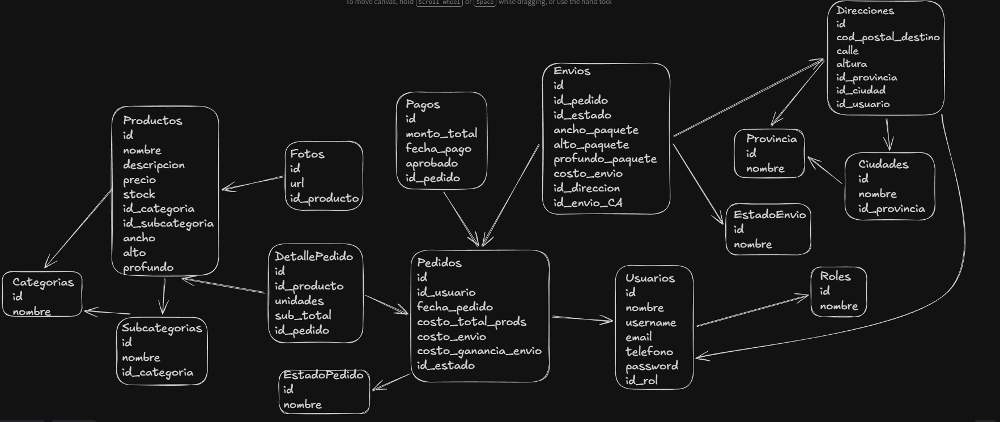
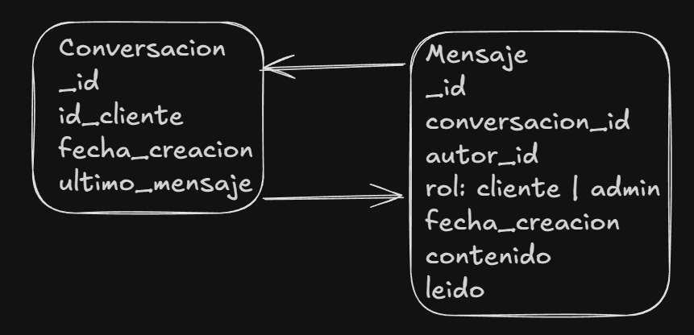
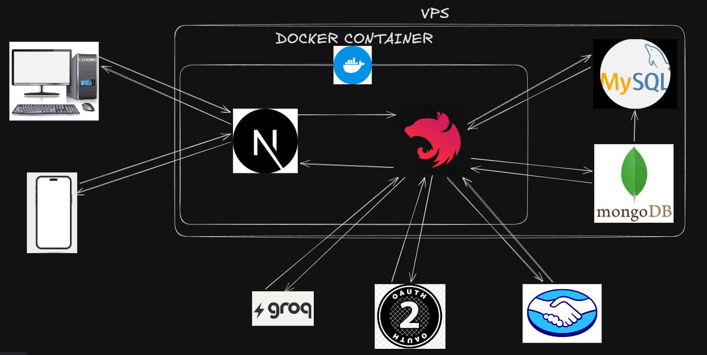

# Tribal Trend

## Índice
- [1. Cómo ejecutar el programa localmente](#1-cómo-ejecutar-el-programa-localmente)
  - [A. Sin Docker](#a-sin-docker)
  - [B. Con Docker](#b-con-docker)
- [2. Stack Tecnológico del proyecto](#2-stack-tecnológico-del-proyecto)
- [3. Roles](#3-roles)
- [4. Requerimientos](#4-requerimientos)
- [5. Modelado de Datos](#5-modelado-de-datos)
  - [A. Relacional](#a-relacional)
  - [B. No relacional](#b-no-relacional)
- [6. Métricas](#6-métricas)
- [7. Arquitectura del proyecto](#7-arquitectura-del-proyecto)
- [8. Documentación API](#8-documentación-api)

## 1. Cómo ejecutar el programa localmente

### A. Sin Docker

#### Prerrequisitos
- Node.js 20+
- npm 10+

#### 1) Backend
```bash
cd backend
```

```bash
npm install
```

```bash
npm run start:dev
```

El backend levanta en `http://localhost:3001` (según `PORT` en `.env`).

#### 2) Frontend
```bash
cd frontend
```

```bash
npm install
```

```bash
npm run dev
```

El frontend levanta en `http://localhost:3000`.

#### Variables de entorno
Para acceso a estas por favor contactarse de forma directa conmigo.

### B. Con Docker

Desde la raíz del proyecto:

```bash
docker compose up --build
```

Servicios esperados con `docker-compose.yml`:
- Frontend: `http://localhost:3000`
- Backend: `http://localhost:3001`

Para apagar y limpiar volúmenes:

```bash
docker compose down -v
```

Para entorno productivo (archivo alternativo):

```bash
docker compose -f docker-compose.prod.yml up --build -d
```

## 2. Stack Tecnológico del proyecto


- Frontend: Next.js 16, React 19, TypeScript, Tailwind CSS
- Backend: NestJS 11, TypeScript
- Base de datos relacional: MySQL + Sequelize
- Base de datos no relacional: MongoDB + Mongoose
- Tiempo real: Socket.IO (backend + frontend)
- Autenticación: JWT
- Documentación API: Swagger (`/swagger`)
- Contenedores: Docker / Docker Compose

## 3. Roles

### Matriz de roles

| Rol | Descripción |
|---|---|
| **Visitante** | Usuario no autenticado que navega el sitio y consulta catálogo. |
| **Cliente** | Visitante registrado que puede comprar, pagar, chatear con soporte y gestionar su cuenta. |
| **Administrador** | Usuario con permisos de gestión integral del negocio, pedidos, métricas y soporte. |

### Resumen rápido
- **Visitante**: acceso público al ecommerce.
- **Cliente**: flujo completo de compra y postventa.
- **Administrador**: operación y administración de toda la plataforma.

## 4. Requerimientos

### ✅ Requerimientos funcionales por rol

#### 👤 Visitante
- Consultar Catálogo de productos
- Filtrar productos
- Ver detalle de un producto con sus reseñas
- Registrarse como cliente

#### 🛒 Cliente
- Consultar Catálogo de productos
- Filtrar productos
- Ver detalle de un producto con sus reseñas
- Registrarse como cliente
- Iniciar sesión
- Realizar y Pagar Pedidos
- Calificar productos previamente comprados
- Chat con soporte administrativo
- Consultar mis pedidos, con filtrado
- Ver detalle de un pedido específico
- Configurar mi cuenta, mis direcciones, y mis datos personales
- Cerrar sesión

#### 🛠️ Administrador
- Consultar Catálogo de productos
- Filtrar productos
- Ver detalle de un producto con sus reseñas
- Iniciar sesión
- Modificar estado de un pedido y su envío respectivo
- ABMC de Productos, incluyendo fotografías de los mismos
- Consultar todos los pedidos, con filtrado
- Ver detalle de un pedido específico
- ABMC de Categorías de productos
- ABMC de Subcategorías de productos
- ABMC de Estados de Pedido
- ABMC de Estados de Envío
- Chat de comunicación en tiempo real con clientes registrados
- Consultar métricas: de productos, pedidos y usuarios
- Generar resumen administrativo con Inteligencia Artificial (IA) con los eventos sucedidos en los últimos 3 días y sugerencias de acción para el administrador
- Cerrar sesión

### 🔒 Requerimientos no funcionales
- La página debe tener un estilo otoñal y tribal, con colores tierra
- La página debe tener el logo en las siguientes localizaciones:
  - En el navegador
  - En el fondo como marca de agua
  - En la barra de navegación
- La página no debe tardar más de 5 segundos en cargar
- Se debe contar con prácticas de seguridad informática básicas
- Se debe mandar un mail al administrador y al cliente posterior a la compra

## 5. Modelado de Datos

### A. Relacional



### B. No Relacional



## 6. Métricas

### PRODUCTOS
- Productos más vendidos en total (top 10) según stock vendido
- Productos menos vendidos en total (top 10) según stock vendido
- Productos vendidos por mes
- Productos mejor calificados (top 10)
- Productos peor calificados (top 10)

### VENTAS/PAGOS
- Promedio gastado en total
- Máxima venta
- Mínima venta
- Ventas por mes (cantidad)
- Ventas por mes (monto)

### PEDIDOS
- Cantidad de pedidos por estado de pedido
- Cantidad de pedidos por estado de envío
- Pedidos realizados por mes

### CLIENTES
- Porcentaje de clientes que tienen al menos un pedido registrado en la plataforma
- TOP 10 clientes con más pedidos en la plataforma
- Usuarios registrados en el período

## 7. Arquitectura del proyecto



## 8. Documentación API

Con el backend levantado (con o sin contenedor), la documentación Swagger está disponible en:

```bash
http://localhost:3001/swagger
```

También se puede acceder mediante:

```bash
http://localhost:3001/docs
```

